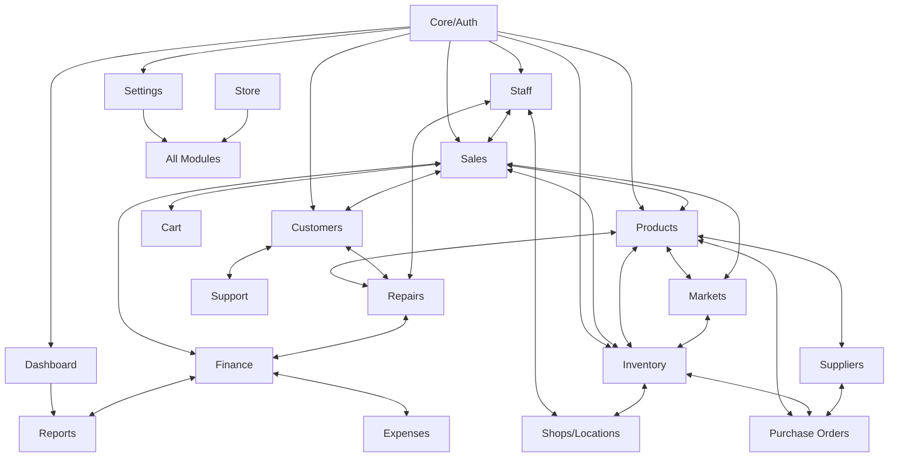
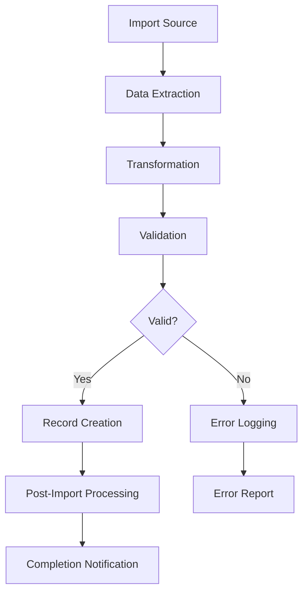
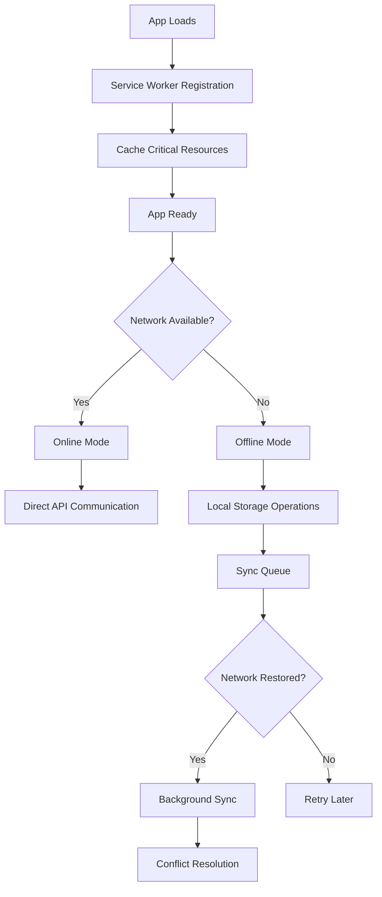
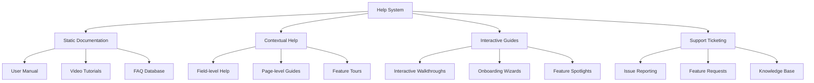
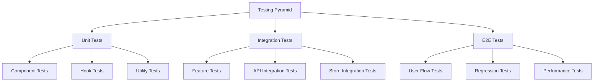

# POS System Architecture and Design Patterns

## System Architecture

### Frontend Architecture
The POS system follows a feature-based architecture with a clear separation of concerns:

```
src/
├── app/            # Application core setup
├── components/     # Shared UI components
├── features/       # Feature modules
├── layouts/        # Page layouts
├── lib/            # Core utilities and shared libraries
├── routes/         # Routing configuration
├── services/       # Global services
├── styles/         # Global styles
├── types/          # Global TypeScript types
└── utils/          # Shared utility functions
```

#### Feature Module Structure
Each feature follows a standardized structure:

```
features/[feature-name]/
├── components/     # UI components
├── context/        # State management
├── hooks/          # Custom hooks
├── pages/          # Page components
├── services/       # API services
├── types/          # TypeScript types
├── utils/          # Utility functions
└── index.ts        # Public API exports
```

### Complete Module Ecosystem

The POS system consists of the following interconnected modules:



#### Module Descriptions

1. **Sales Module**
   - Manages the sales process including POS interface, transactions, returns, discounts
   - Integrates with Cart, Products, Customers, and Finance

2. **Products Module**
   - Handles product catalog, categorization, pricing, and details
   - Connects with Inventory, Suppliers, and Markets

3. **Customers Module**
   - Manages customer information, history, loyalty programs
   - Connects with Sales, Repairs, and Support

4. **Staff Module**
   - Handles employee management, roles, permissions, performance
   - Connects with Sales, Repairs, and Shops/Locations

5. **Inventory Module**
   - Tracks stock across locations, transfers, history
   - Connects with Products, Shops/Locations, and Purchase Orders

6. **Suppliers Module**
   - Manages vendor information, performance, and relationships
   - Connects with Products and Purchase Orders

7. **Purchase Orders Module**
   - Handles ordering process from suppliers
   - Connects with Suppliers, Inventory, and Finance

8. **Repair Services Module**
   - Manages repair tickets, workflow, parts, technicians
   - Connects with Customers, Products, Staff, and Finance

9. **Markets Module**
   - Handles marketplace integrations, listings, synchronization
   - Connects with Products, Sales, and Inventory

10. **Shops/Locations Module**
    - Manages multiple stores, locations, settings
    - Connects with Staff, Inventory, and Sales

11. **Finance Module**
    - Handles financial tracking, reporting, taxes
    - Connects with Sales, Expenses, and Reports

12. **Reports Module**
    - Generates analytics and reports across all areas
    - Connects with all other modules for data collection

13. **Settings Module**
    - Configures system-wide and module-specific settings
    - Affects all other modules

14. **Cart Module**
    - Manages shopping cart during sales process
    - Connects with Sales, Products, and Customers

15. **Dashboard Module**
    - Provides overview and quick access to key information
    - Connects with Reports and other modules for data

16. **Expenses Module**
    - Tracks and categorizes business expenses
    - Connects with Finance and Reports

17. **Support Module**
    - Provides help resources and documentation
    - Connects with Customers and other modules

18. **Store Module**
    - Manages company-wide settings and structure
    - Affects all other modules

### API Integration
The system uses a service-based approach for API integration:

1. **Service Layer**: Encapsulates all API calls
2. **Custom Hooks**: Wrap services and manage loading/error states
3. **Context Providers**: Share data across components
4. **Event Bus**: Handle cross-module communication

## Key Design Patterns

### Component Composition Pattern
Components are built following composition principles:

```tsx
// Component composition example
<Card>
  <CardHeader>
    <CardTitle>Product Information</CardTitle>
  </CardHeader>
  <CardContent>
    <ProductDetails product={product} />
  </CardContent>
  <CardFooter>
    <Button>Edit</Button>
  </CardFooter>
</Card>
```

### Context + Reducer Pattern
State management is implemented using Context API with reducers:

```tsx
// Context definition
export const ProductContext = createContext<ProductContextType | undefined>(undefined);

// Provider with reducer
export function ProductProvider({ children }: { children: React.ReactNode }) {
  const [state, dispatch] = useReducer(productReducer, initialState);
  
  // API integration with effects
  useEffect(() => {
    // Fetch products and update state
  }, []);
  
  return (
    <ProductContext.Provider value={{ state, dispatch }}>
      {children}
    </ProductContext.Provider>
  );
}

// Custom hook
export function useProduct() {
  const context = useContext(ProductContext);
  if (!context) throw new Error('useProduct must be used within ProductProvider');
  return context;
}
```

### Data Fetching Pattern
Data fetching follows a consistent pattern using custom hooks:

```tsx
// Custom hook for data fetching
export function useProducts() {
  const [products, setProducts] = useState<Product[]>([]);
  const [loading, setLoading] = useState(true);
  const [error, setError] = useState<Error | null>(null);
  
  useEffect(() => {
    async function fetchProducts() {
      try {
        setLoading(true);
        const data = await productService.getProducts();
        setProducts(data);
      } catch (err) {
        setError(err as Error);
      } finally {
        setLoading(false);
      }
    }
    
    fetchProducts();
  }, []);
  
  return { products, loading, error };
}
```

### Form Management Pattern
Forms are managed using React Hook Form with Zod validation:

```tsx
// Form schema
const productSchema = z.object({
  name: z.string().min(2, 'Name must be at least 2 characters'),
  price: z.number().min(0, 'Price must be positive'),
  // ...other fields
});

// Form component
export function ProductForm({ onSubmit }: ProductFormProps) {
  const form = useForm<ProductFormValues>({
    resolver: zodResolver(productSchema),
    defaultValues: { name: '', price: 0 }
  });
  
  return (
    <Form {...form}>
      <form onSubmit={form.handleSubmit(onSubmit)}>
        <FormField
          control={form.control}
          name="name"
          render={({ field }) => (
            <FormItem>
              <FormLabel>Product Name</FormLabel>
              <FormControl>
                <Input {...field} />
              </FormControl>
              <FormMessage />
            </FormItem>
          )}
        />
        {/* Other form fields */}
        <Button type="submit">Save Product</Button>
      </form>
    </Form>
  );
}
```

### Event Bus Pattern
Cross-module communication uses an event bus system:

```tsx
// Event definitions
type EventMap = {
  'product:updated': Product;
  'cart:item-added': CartItem;
  'customer:selected': Customer;
  // ...other events
};

// Event bus implementation
export const eventBus = {
  on<K extends keyof EventMap>(event: K, handler: (data: EventMap[K]) => void) {
    // Subscribe to event
    return () => {
      // Unsubscribe function
    };
  },
  
  emit<K extends keyof EventMap>(event: K, data: EventMap[K]) {
    // Emit event to subscribers
  }
};

// Usage in components
useEffect(() => {
  const unsubscribe = eventBus.on('product:updated', (product) => {
    // Handle product update
  });
  
  return unsubscribe;
}, []);
```

### Feature-Specific Patterns

#### Repair Service Workflow Pattern
The repair service module implements a state machine pattern for workflow:

```tsx
// Repair status workflow
const repairWorkflow = {
  states: {
    'received': { next: ['diagnosed', 'cancelled'] },
    'diagnosed': { next: ['awaiting-approval', 'awaiting-parts', 'in-progress', 'cancelled'] },
    'awaiting-approval': { next: ['approved', 'declined', 'cancelled'] },
    'approved': { next: ['awaiting-parts', 'in-progress'] },
    'awaiting-parts': { next: ['in-progress', 'cancelled'] },
    'in-progress': { next: ['completed', 'paused', 'cancelled'] },
    'paused': { next: ['in-progress', 'cancelled'] },
    'completed': { next: ['delivered', 'returned-to-service'] },
    'delivered': { next: [] },
    'returned-to-service': { next: [] },
    'declined': { next: [] },
    'cancelled': { next: [] }
  },
  
  canTransition(current: RepairStatus, next: RepairStatus): boolean {
    return this.states[current].next.includes(next);
  }
};
```

#### Marketplace Integration Pattern
The markets module uses an adapter pattern for different marketplaces:

```tsx
// Marketplace adapter interface
interface MarketplaceAdapter {
  getProducts(): Promise<Product[]>;
  syncProducts(products: Product[]): Promise<SyncResult>;
  getOrders(): Promise<Order[]>;
  updateOrderStatus(orderId: string, status: OrderStatus): Promise<boolean>;
}

// Specific marketplace implementations
class AmazonMarketplace implements MarketplaceAdapter {
  // Amazon-specific implementation
}

class EbayMarketplace implements MarketplaceAdapter {
  // eBay-specific implementation
}

// Usage in service
class MarketplaceService {
  private adapters: Record<string, MarketplaceAdapter> = {};
  
  registerAdapter(marketplace: string, adapter: MarketplaceAdapter) {
    this.adapters[marketplace] = adapter;
  }
  
  async syncProducts(marketplace: string, products: Product[]) {
    const adapter = this.adapters[marketplace];
    if (!adapter) throw new Error(`No adapter for ${marketplace}`);
    
    return adapter.syncProducts(products);
  }
  
  // Other methods
}
```

## Component Hierarchy

The system follows an atomic design approach with these component levels:

1. **Atoms**: Basic UI components (Button, Input, etc.)
2. **Molecules**: Simple compositions (FormField, ProductCard, etc.)
3. **Organisms**: Complex UI sections (ProductTable, CheckoutForm, etc.)
4. **Templates**: Page layouts without specific data
5. **Pages**: Complete pages with data integration

## State Management Strategy

State is managed at multiple levels:

1. **Local Component State**: UI state specific to a component
   ```tsx
   const [isOpen, setIsOpen] = useState(false);
   ```

2. **Feature-level State**: State shared across a feature module
   ```tsx
   const { products, loading } = useProducts();
   ```

3. **Application-level State**: Global state shared across features
   ```tsx
   const { user } = useAuth();
   const { cart } = useCart();
   ```

4. **URL State**: State represented in the URL
   ```tsx
   const [searchParams, setSearchParams] = useSearchParams();
   ```

## Error Handling Strategy

The system implements a comprehensive error handling approach:

1. **API Error Handling**: Consistent error handling in API services
2. **Component Error Boundaries**: Isolate errors within feature areas
3. **Form Validation Errors**: Clear error messages on form fields
4. **Global Error Handling**: Capture and log unhandled exceptions
5. **Retry Mechanisms**: Automatic retry for transient failures

## Performance Optimization Patterns

The system implements several performance optimization techniques:

1. **Code Splitting**: Lazy-loading routes and components
2. **Virtualization**: Using virtual lists for large datasets
3. **Memoization**: Using React.memo, useMemo, and useCallback
4. **Optimistic Updates**: Updating UI before API calls complete
5. **Debouncing/Throttling**: Limiting frequent function calls 

## Data Migration & Import/Export Framework

### Data Import Architecture

The system implements a comprehensive data import framework for migrating data from external systems:



#### Import Strategies

1. **File-based Import**
   - Supports CSV, Excel, and JSON formats
   - Template-based data mapping
   - Batch processing for large datasets
   - Progress tracking and resumability

2. **API-based Import**
   - Direct integration with common POS/ERP systems
   - OAuth-based authentication for third-party systems
   - Incremental data synchronization
   - Conflict resolution strategies

3. **Manual Entry**
   - Form-based data entry for small datasets
   - Data validation during entry
   - Bulk editing capabilities
   - Template-based entry forms

#### Data Transformation

Data transformation follows a pipeline pattern:

```tsx
// Data transformation pipeline
const importPipeline = pipe(
  extractData,
  mapToSchema,
  validateData,
  transformRelationships,
  handleDuplicates,
  createRecords,
  generateReport
);

// Usage
const importResult = await importPipeline(importSource, options);
```

### Data Export Framework

The export system provides flexible options for exporting data:

1. **Export Formats**
   - PDF (documents, reports, labels)
   - Excel (data tables, analysis reports)
   - CSV (raw data export)
   - JSON (system backup, API integration)

2. **Export Scopes**
   - Full system backup
   - Module-specific exports (customers, products, etc.)
   - Filtered data exports (by date range, status, etc.)
   - Report-based exports

3. **Export Process**
   ```mermaid
   graph TD
       A[Export Request] --> B[Data Fetching]
       B --> C[Data Transformation]
       C --> D[Format Conversion]
       D --> E[File Generation]
       E --> F[Delivery Method]
       F -->|Download| G[Browser Download]
       F -->|Email| H[Email Distribution]
       F -->|API| I[API Response]
   ```

4. **Bulk Operations**
   - Batch processing for large exports
   - Background processing with notification
   - Scheduled exports (daily, weekly, monthly)
   - Export history and reuse

## Offline/Online Synchronization

### Offline Capability Architecture

The system implements a progressive web app approach with offline capabilities:



### Data Synchronization Strategy

1. **Data Storage Layers**
   - Remote API (primary source of truth)
   - IndexedDB (offline data store)
   - Memory cache (performance optimization)

2. **Operational Modes**
   - Online (direct API operations)
   - Offline-capable (critical functions work offline)
   - Offline-aware (read-only for non-critical functions)

3. **Sync Process Implementation**

   ```tsx
   // Offline transaction handler
   const performTransaction = async (transaction: Transaction) => {
     try {
       // Try online first
       if (navigator.onLine) {
         return await apiService.processTransaction(transaction);
       }
       
       // Fall back to offline
       await offlineStore.queueTransaction(transaction);
       return { status: 'queued', id: transaction.id };
     } catch (error) {
       // Handle errors
       await errorLogger.logTransactionError(error, transaction);
       return { status: 'error', error };
     }
   };
   
   // Sync manager
   const syncManager = {
     async syncQueuedTransactions() {
       if (!navigator.onLine) return;
       
       const pendingTransactions = await offlineStore.getPendingTransactions();
       
       for (const tx of pendingTransactions) {
         try {
           const result = await apiService.processTransaction(tx);
           await offlineStore.markAsSynced(tx.id, result);
         } catch (error) {
           if (isConflictError(error)) {
             await conflictResolver.resolve(tx, error.serverState);
           } else {
             await offlineStore.markAsFailedSync(tx.id, error);
           }
         }
       }
     }
   };
   ```

### Conflict Resolution

1. **Conflict Types**
   - Data version conflicts (concurrent edits)
   - Business rule violations (inventory conflicts)
   - Reference integrity issues (deleted dependencies)

2. **Resolution Strategies**
   - Client wins (override server)
   - Server wins (discard local changes)
   - Merge (combine changes when possible)
   - Manual resolution (user intervention)

3. **Sync Progress Tracking**
   - Background sync status indicators
   - Detailed sync history logs
   - Error reporting and retry mechanisms

### Critical Offline Capabilities

1. **Sales Processing**
   - Complete transaction creation
   - Receipt generation
   - Payment recording (with sync flagging)

2. **Inventory Management**
   - Stock checks and holds
   - Basic inventory adjustments
   - Transfer initiations

3. **Customer Management**
   - Customer lookup
   - Basic customer creation
   - Purchase history access

## User Onboarding & Help System

### Help System Architecture

The system implements a contextual help framework:



### Content Management System

1. **Documentation Structure**
   - Role-based content targeting
   - Feature-based organization
   - Searchable knowledge base
   - Version-specific documentation

2. **Content Types**
   - Text articles with rich formatting
   - Embedded video tutorials
   - Interactive guides
   - Downloadable resources
   - FAQ collections

3. **Content Delivery**

   ```tsx
   // Help context provider
   export function HelpProvider({ children }: { children: React.ReactNode }) {
     const [helpState, dispatch] = useReducer(helpReducer, initialHelpState);
     
     // Track current context
     useEffect(() => {
       const unsubscribe = navigation.subscribe(route => {
         dispatch({ type: 'SET_CONTEXT', payload: getContextFromRoute(route) });
       });
       
       return unsubscribe;
     }, []);
     
     // Load relevant help content
     useEffect(() => {
       async function loadContextualHelp() {
         if (!helpState.context) return;
         
         const content = await helpService.getContentForContext(helpState.context);
         dispatch({ type: 'SET_CONTENT', payload: content });
       }
       
       loadContextualHelp();
     }, [helpState.context]);
     
     return (
       <HelpContext.Provider value={{ state: helpState, dispatch }}>
         {children}
         <HelpPanel />
         <GuidedTour />
       </HelpContext.Provider>
     );
   }
   ```

### User Onboarding Flow

1. **Initial Onboarding**
   - Welcome tour on first login
   - Role-based getting started guides
   - Personalized setup wizards
   - Progress tracking

2. **Feature Discovery**
   - New feature announcements
   - Feature spotlight tours
   - Progressive feature unlocking
   - Usage suggestions

3. **Continuous Learning**
   - Advanced feature prompts
   - Efficiency tips based on usage patterns
   - Role-specific training paths
   - Certification programs

### Support Integration

1. **In-app Support**
   - Contextual help request
   - Screen sharing capability
   - Issue reporting with diagnostics
   - Feedback collection

2. **Support Ticket Management**
   - Ticket creation and tracking
   - Attachment support
   - Priority classification
   - Resolution tracking

## Testing Strategy Details

### Test Architecture

The testing approach follows a comprehensive pyramid structure:



### Test Organization

1. **Directory Structure**
   ```
   src/
   ├── features/
   │   └── [feature]/
   │       ├── components/
   │       │   └── Component.tsx
   │       │   └── Component.test.tsx
   │       ├── hooks/
   │       │   └── useFeature.ts
   │       │   └── useFeature.test.ts
   │       └── __tests__/
   │           ├── integration/
   │           └── utils/
   ├── test/
   │   ├── e2e/
   │   ├── mocks/
   │   ├── fixtures/
   │   └── utils/
   ```

2. **Naming Conventions**
   - Unit tests: `[filename].(test|spec).[ts|tsx]`
   - Integration tests: `[feature].integration.[test|spec].ts`
   - E2E tests: `[workflow].e2e.[test|spec].ts`

### Test Implementation

1. **Component Testing**

   ```tsx
   // Component test example
   describe('ProductCard', () => {
     it('renders product information correctly', () => {
       const product = createMockProduct();
       const { getByText, getByTestId } = render(<ProductCard product={product} />);
       
       expect(getByText(product.name)).toBeInTheDocument();
       expect(getByText(`$${product.price.toFixed(2)}`)).toBeInTheDocument();
       expect(getByTestId('product-image')).toHaveAttribute('src', product.imageUrl);
     });
     
     it('calls onAddToCart when add button is clicked', () => {
       const product = createMockProduct();
       const onAddToCart = vi.fn();
       const { getByRole } = render(
         <ProductCard product={product} onAddToCart={onAddToCart} />
       );
       
       fireEvent.click(getByRole('button', { name: /add to cart/i }));
       expect(onAddToCart).toHaveBeenCalledWith(product.id);
     });
   });
   ```

2. **Hook Testing**

   ```tsx
   // Hook test example
   describe('useProducts', () => {
     beforeEach(() => {
       vi.resetAllMocks();
     });
     
     it('returns products data when API call succeeds', async () => {
       const mockProducts = [createMockProduct(), createMockProduct()];
       vi.spyOn(productService, 'getProducts').mockResolvedValue(mockProducts);
       
       const { result, waitForNextUpdate } = renderHook(() => useProducts());
       
       expect(result.current.loading).toBe(true);
       expect(result.current.products).toEqual([]);
       
       await waitForNextUpdate();
       
       expect(result.current.loading).toBe(false);
       expect(result.current.products).toEqual(mockProducts);
       expect(result.current.error).toBeNull();
     });
     
     it('returns error when API call fails', async () => {
       const mockError = new Error('Failed to fetch');
       vi.spyOn(productService, 'getProducts').mockRejectedValue(mockError);
       
       const { result, waitForNextUpdate } = renderHook(() => useProducts());
       
       await waitForNextUpdate();
       
       expect(result.current.loading).toBe(false);
       expect(result.current.products).toEqual([]);
       expect(result.current.error).toEqual(mockError);
     });
   });
   ```

3. **Integration Testing**

   ```tsx
   // Integration test example
   describe('Product Management Integration', () => {
     beforeEach(() => {
       setupTestDatabase();
     });
     
     afterEach(() => {
       cleanupTestDatabase();
     });
     
     it('should create a product and show it in the list', async () => {
       // Render the product management feature with context providers
       const { getByRole, getByLabelText, findByText } = render(
         <TestProviders>
           <ProductManagement />
         </TestProviders>
       );
       
       // Navigate to create product form
       fireEvent.click(getByRole('button', { name: /add product/i }));
       
       // Fill out the form
       fireEvent.change(getByLabelText(/name/i), { target: { value: 'Test Product' } });
       fireEvent.change(getByLabelText(/price/i), { target: { value: '19.99' } });
       fireEvent.change(getByLabelText(/description/i), { 
         target: { value: 'Test description' }
       });
       
       // Submit the form
       fireEvent.click(getByRole('button', { name: /save/i }));
       
       // Verify the product appears in the list
       const productName = await findByText('Test Product');
       expect(productName).toBeInTheDocument();
     });
   });
   ```

### Test Data Management

1. **Test Data Sources**
   - Mock factories for entity creation
   - Fixtures for common test scenarios
   - Generators for randomized data
   - Test database seeding

2. **Mock Implementations**
   - Service mocks for API testing
   - Component mocks for integration testing
   - Context mocks for state management

3. **Test Utilities**
   - Custom test renderers with providers
   - Authentication helpers
   - Test ID generation
   - Assertion helpers

### Continuous Integration

1. **Test Execution**
   - Unit tests on every PR
   - Integration tests on feature branches
   - E2E tests before production deployment

2. **Coverage Reporting**
   - Line coverage targets (>70%)
   - Critical path coverage
   - Feature coverage tracking
   - Coverage trend monitoring

3. **Quality Gates**
   - PR checks for test coverage
   - Performance benchmark tests
   - Accessibility compliance tests
   - Security vulnerability tests 

## Server Architecture
1. Entry Point Pattern:
   - Single entry point through `src/index.ts`
   - Proper process and port management
   - Graceful shutdown handling
   - Environment configuration management

2. Process Management:
   - Port availability checking before startup
   - Automatic process killing for port conflicts
   - Graceful shutdown on SIGTERM and SIGINT
   - Cross-platform process management

3. Development Workflow:
   - Clean builds with rimraf
   - Hot reloading in development
   - TypeScript compilation pipeline
   - Environment-based configuration

4. Error Handling:
   - Graceful error recovery
   - Process exit on critical errors
   - Proper cleanup on shutdown
   - Cross-platform error handling

## Best Practices
1. Server Startup:
   - Always check port availability
   - Handle process signals properly
   - Clean up resources on shutdown
   - Use environment variables for configuration

2. Development:
   - Use clean builds
   - Implement hot reloading
   - Maintain proper TypeScript configuration
   - Follow consistent error handling patterns

3. Process Management:
   - Check for existing processes
   - Handle port conflicts gracefully
   - Implement proper shutdown procedures
   - Use cross-platform commands

4. Configuration:
   - Use environment variables
   - Provide example configurations
   - Document all settings
   - Validate required settings 