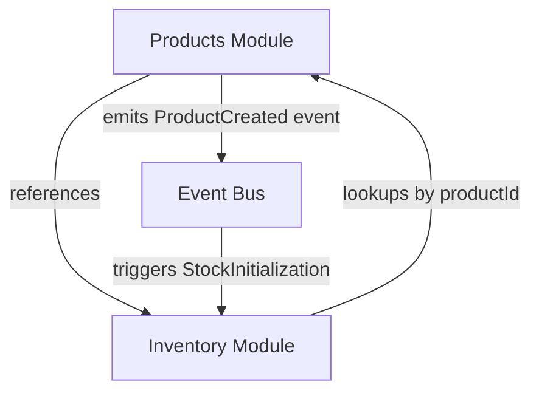
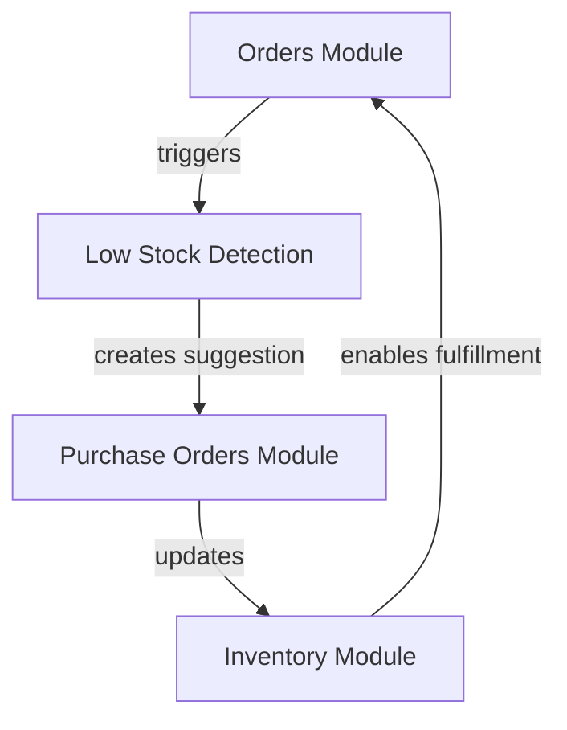
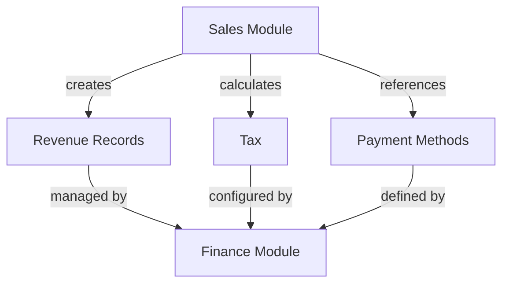
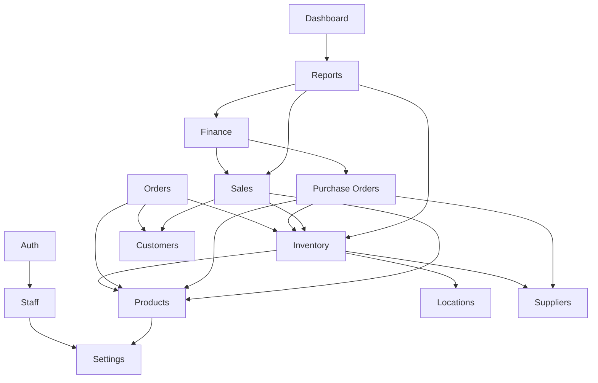

# Feature Module Boundary Definition

This document defines the boundaries, responsibilities, and interaction patterns between feature modules in the POS system. Clear module boundaries help prevent code duplication, reduce conflicts, and improve maintainability.

## Module Boundary Principles

### Core Principles

1. **Single Responsibility**: Each module should have a clear, focused responsibility.
2. **Domain Integrity**: Data models should be owned by a single module; others reference them.
3. **Explicit Dependencies**: All cross-module dependencies must be explicitly declared.
4. **Interface Stability**: Public interfaces between modules should change infrequently.
5. **Minimal Coupling**: Modules should interact through well-defined interfaces.

### Boundary Enforcement Mechanisms

1. **Type Definitions**: Types define the contract between modules
2. **Service Interfaces**: Services expose functionality through typed methods
3. **Context Providers**: Modules expose state via context providers
4. **Event Bus**: Cross-cutting concerns use publish/subscribe patterns
5. **Feature Flags**: Control feature visibility and access

## Module Responsibilities

### Overview of Feature Modules

| Module | Primary Responsibility | Domain Objects |
|--------|------------------------|----------------|
| Products | Product definition and metadata | Product, Category, Variant |
| Inventory | Stock management and tracking | Stock, StockMovement, Warehouse |
| Orders | Customer orders and fulfillment | Order, OrderItem, Fulfillment |
| Purchase Orders | Supplier orders and receiving | PurchaseOrder, POItem, Receipt |
| Sales | Point of sale and transactions | Sale, Transaction, Payment |
| Finance | Financial tracking and reporting | Revenue, Expense, Tax |
| Customers | Customer management and loyalty | Customer, CustomerGroup, Loyalty |
| Suppliers | Supplier management and contracts | Supplier, Contract, SupplierContact |
| Staff | Employee management and access | Staff, Role, Permission |
| Settings | Application configuration | Setting, Preference, Configuration |

## Detailed Module Boundaries

### Products vs Inventory

#### Products Module

**Responsibility**:
- Define product attributes, variants, and categories
- Manage product information and metadata
- Configure product pricing rules
- Set up product-specific settings

**Domain Objects**:
- `Product`: Core product definition, attributes
- `ProductVariant`: Variant-specific data (size, color)
- `ProductCategory`: Categorization hierarchy
- `ProductImage`: Visual representation
- `ProductTag`: Classification for grouping

**Public Interfaces**:
- `ProductService`: CRUD operations for products
- `ProductContext`: Product state and operations
- `useProduct`: Hook for product data access

#### Inventory Module

**Responsibility**:
- Track stock levels across locations
- Manage inventory movements and adjustments
- Handle stock alerts and reordering
- Provide inventory valuation

**Domain Objects**:
- `StockLevel`: Quantity of product at location
- `StockMovement`: Record of inventory changes
- `StockAdjustment`: Manual corrections to stock
- `Warehouse`: Physical storage location
- `InventoryCount`: Stocktaking records

**Public Interfaces**:
- `InventoryService`: Stock operations and queries
- `InventoryContext`: Inventory state and operations
- `useInventory`: Hook for inventory data access

#### Interaction Pattern



**Rules**:
1. Products module owns product definitions
2. Inventory module references products by ID only
3. Products should have no knowledge of inventory levels
4. Inventory changes notify products module via events

### Orders vs Purchase Orders

#### Orders Module

**Responsibility**:
- Customer order management
- Order processing workflow
- Fulfillment tracking
- Customer communication

**Domain Objects**:
- `Order`: Customer purchase record
- `OrderItem`: Individual product in order
- `OrderStatus`: State of order processing
- `Fulfillment`: Order delivery information
- `Return`: Product return/exchange

**Public Interfaces**:
- `OrderService`: CRUD and process operations
- `OrderContext`: Order state and operations
- `useOrder`: Hook for order data access

#### Purchase Orders Module

**Responsibility**:
- Supplier order management
- Stock procurement process
- Receiving and quality control
- Supplier communication

**Domain Objects**:
- `PurchaseOrder`: Supplier order record
- `POItem`: Individual product being ordered
- `POStatus`: State of PO processing
- `Receipt`: Record of goods received
- `SupplierReturn`: Return to supplier

**Public Interfaces**:
- `PurchaseOrderService`: CRUD and process operations
- `PurchaseOrderContext`: PO state and operations
- `usePurchaseOrder`: Hook for PO data access

#### Interaction Pattern



**Rules**:
1. Orders consume inventory; Purchase Orders replenish inventory
2. Both reference the same product catalog
3. No direct dependency between Orders and Purchase Orders
4. Both update inventory through inventory module interfaces

### Sales vs Finance

#### Sales Module

**Responsibility**:
- Point of sale operations
- Transaction processing
- Customer checkout flow
- Sales promotions and discounts

**Domain Objects**:
- `Sale`: Record of sales transaction
- `LineItem`: Individual product sold
- `Discount`: Price reduction
- `Payment`: Transaction payment method
- `Receipt`: Customer receipt

**Public Interfaces**:
- `SalesService`: Sales operations
- `SalesContext`: Sales state and operations
- `useSales`: Hook for sales data access

#### Finance Module

**Responsibility**:
- Financial tracking and reporting
- Tax management
- Expense tracking
- Reconciliation and accounting

**Domain Objects**:
- `Revenue`: Income record
- `Expense`: Cost record
- `TaxRate`: Tax configuration
- `TaxReport`: Tax collection record
- `Reconciliation`: Cash balancing record

**Public Interfaces**:
- `FinanceService`: Financial operations
- `FinanceContext`: Finance state and operations
- `useFinance`: Hook for finance data access

#### Interaction Pattern



**Rules**:
1. Sales module records transaction data
2. Finance module transforms sales into financial records
3. Finance module owns tax configuration
4. Sales module applies tax rules at transaction time

## Cross-Cutting Concerns

### Data Synchronization

1. **Events**:
   - Modules publish domain events when significant changes occur
   - Other modules subscribe to relevant events
   - Event bus provides decoupling between modules

2. **Shared Services**:
   - `SyncService` manages data synchronization between modules
   - Changes are propagated through type-safe interfaces
   - Conflict resolution strategies are defined per domain

### Security and Access Control

1. **Permission Model**:
   - Each module defines required permissions
   - Staff module manages role-based access
   - Settings module configures permission policies

2. **Data Access**:
   - Modules implement row-level security for their domain objects
   - Cross-module data access is controlled through service interfaces
   - Audit trail is maintained for sensitive operations

## Implementation Guidelines

### Directory Structure

Each feature module should follow this structure:

```
src/features/[module-name]/
├── components/         # UI components
├── context/            # Context providers
├── hooks/              # Custom hooks
├── pages/              # Page components
├── services/           # API and business logic
├── types/              # Type definitions
│   └── [domain].types.ts
├── utils/              # Utility functions
└── index.ts            # Public interface
```

### Module Integration

Modules should integrate through:

1. **Public API**:
   - Export types, functions, and components through `index.ts`
   - Only expose what's necessary for other modules

2. **Context Composition**:
   - Use the Context Registry pattern for cross-module state
   - Implement providers and consumers with clear dependencies

3. **Event-Based Communication**:
   - Define events in `events.ts` within each module
   - Use the central event bus for publishing and subscribing

## Dependency Graph

The following diagram shows the high-level dependencies between modules:



## Conflict Resolution

When modules have overlapping concerns:

1. **Identify Domain Owner**:
   - Determine which module is the natural owner of the data/behavior
   - Move responsibility to that module

2. **Extract Shared Code**:
   - Create shared utilities for common functionality
   - Place shared code in appropriate location

3. **Define Interface**:
   - Create explicit interface for cross-module interaction
   - Document the interface and dependency

## Migration Plan

To resolve existing overlaps and implement clear boundaries:

1. **Audit**:
   - Identify all instances of duplicated types and functionality
   - Map current cross-module dependencies

2. **Consolidate Types**:
   - Move types to appropriate module
   - Update imports to reference new location

3. **Implement Services**:
   - Create service interfaces for cross-module functionality
   - Refactor direct dependencies to use services

4. **Update Components**:
   - Modify components to use appropriate services
   - Update context consumption patterns

5. **Documentation**:
   - Document module boundaries and interfaces
   - Create ADRs for significant boundary decisions

## Module Boundary ADRs

### ADR 1: Product and Inventory Separation

**Context**: 
Products and inventory data are closely related but conceptually distinct. Products represent what we sell, while inventory represents what we have in stock.

**Decision**:
Separate Product and Inventory into distinct modules with clear boundaries.

**Consequences**:
- Improved separation of concerns
- More maintainable data models
- Slight increase in cross-module communication
- Clearer responsibility for product vs. stock data

### ADR 2: Order vs. Purchase Order Modules

**Context**:
Customer orders and supplier purchase orders share similar concepts but serve different business processes.

**Decision**:
Maintain separate Order and Purchase Order modules with independent workflows but shared references to inventory.

**Consequences**:
- Clearer business process implementation
- Reduced confusion between customer and supplier orders
- Both modules impact inventory module, requiring coordination
- Reporting may need to aggregate data from both modules

### ADR 3: Sales and Finance Integration

**Context**:
Sales transactions generate financial data, creating a tight coupling between sales and finance domains.

**Decision**:
Sales module focuses on transaction processing, while Finance module handles financial implications and reporting.

**Consequences**:
- Sales module can focus on customer experience
- Finance module maintains fiscal consistency
- Events must synchronize data between modules
- Changes to one may impact the other

## Next Steps

1. Conduct a comprehensive audit of each module
2. Create detailed interface definitions
3. Implement service abstractions
4. Refactor cross-module dependencies
5. Update documentation 